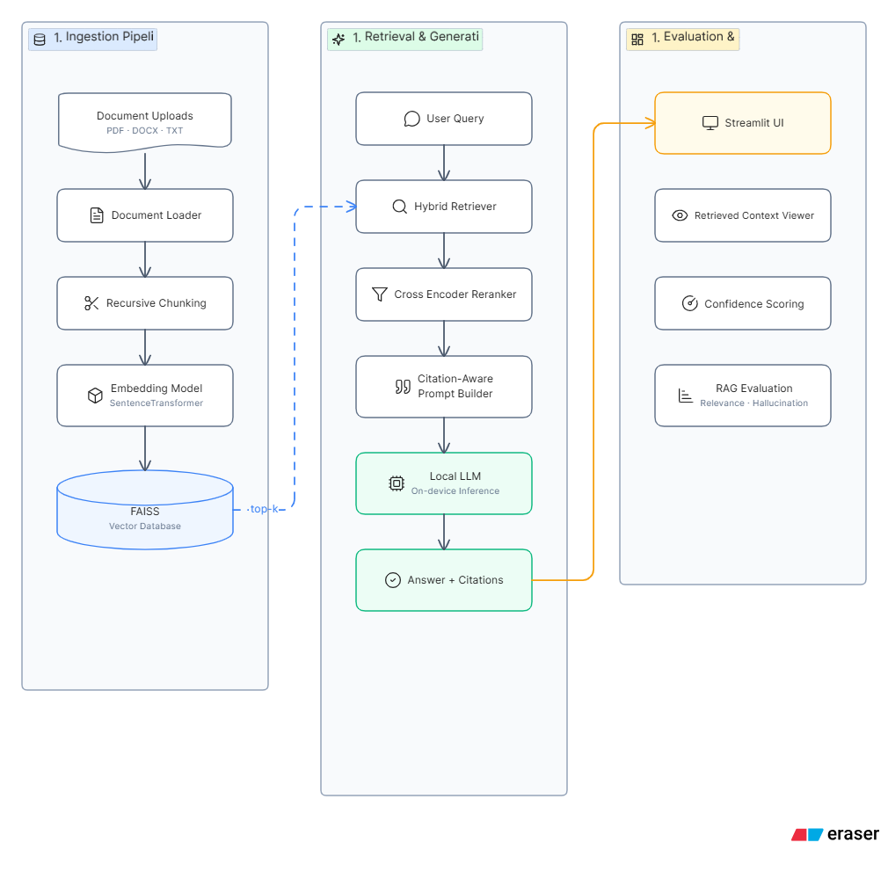

# Fully Local RAG System

A fully local Retrieval-Augmented Generation system designed for document-grounded question answering with transparent retrieval, reranking, citation-aware response generation, confidence scoring, and hallucination risk evaluation.

The system runs without external LLM APIs and is intended for research, experimentation, and evaluation of local RAG pipelines.

## Key Features

- Fully local document question answering
- Hybrid retrieval with semantic and keyword-based search
- SentenceTransformer-based embeddings
- FAISS vector search
- Cross-encoder reranking for improved context precision
- Local LLM-based answer generation
- Citation-aware responses using retrieved source chunks
- Confidence scoring for answer reliability
- Retrieved context viewer for explainability
- Lightweight hallucination and answer-quality evaluation
- Streamlit interface for interactive experimentation

## System Architecture

The system follows a modular RAG architecture. Documents are ingested, chunked, embedded, and indexed locally. At query time, relevant chunks are retrieved, reranked, and passed to a local LLM with citation-aware prompting. The generated answer is evaluated using local heuristic metrics and displayed alongside confidence scores and retrieved evidence.

## Retrieval and Generation Pipeline

1. Documents are loaded from local storage.
2. Text is split into overlapping chunks.
3. Chunks are embedded using SentenceTransformers.
4. ChromaDB stores the document embeddings and retrieves the most semantically similar chunks for a given query.
5. Hybrid retrieval improves recall using lexical matching.
6. A cross-encoder reranker reorders retrieved chunks by relevance.
7. The local LLM receives the reranked context.
8. The answer is generated with inline source citations.
9. Confidence and hallucination metrics are computed locally.
10. Retrieved contexts are displayed for inspection.

## Local Evaluation Metrics

The system includes lightweight local evaluation metrics designed to avoid external judge models.

- **Answer Relevancy**: Measures alignment between the user query and generated answer.
- **Context Match**: Measures how well the answer is supported by retrieved context.
- **Retrieval Quality**: Estimates relevance of retrieved chunks to the query.
- **Hallucination Risk**: Estimates unsupported content in the generated answer.

These metrics use keyword overlap, cosine similarity, retrieval overlap, and heuristic scoring.

## Technology Stack

- Streamlit
- FAISS
- SentenceTransformers
- Cross Encoder Reranker
- Local LLM
- Python
- HuggingFace Transformers

## Architecture Notes

The system prioritizes transparency and local execution. Each stage of the RAG pipeline is independently inspectable, making it suitable for research-oriented evaluation of retrieval quality, grounding behavior, and answer faithfulness.

## Limitations

- Local LLM quality depends on model size and instruction-following ability.
- Heuristic evaluation metrics are lightweight approximations, not replacements for human evaluation.
- Retrieval quality depends on chunking strategy, embedding model, and document structure.

## Future Improvements

- Add configurable embedding and reranking models
- Add benchmark dataset support
- Add batch evaluation mode
- Add experiment tracking for retrieval and generation settings
- Add document-level metadata filtering controls

Architecture Explanation

The system is organized as a fully local RAG pipeline. Documents are first ingested and split into manageable chunks. Each chunk is embedded using a SentenceTransformer model and stored in a FAISS index for semantic retrieval.

When a user asks a question, the system retrieves candidate chunks using hybrid retrieval. A cross-encoder reranker then scores each query-context pair to improve precision. The highest-ranked chunks are passed to the local LLM using a citation-aware prompt, allowing the answer to reference supporting evidence with inline citations.

After generation, the system computes confidence and hallucination-related metrics using lightweight local heuristics. The final response, citations, evaluation scores, confidence score, and retrieved context are shown to the user for transparency.
## 🏗️ System Architecture

  

The project follows a fully local Retrieval-Augmented Generation (RAG) pipeline with recursive chunking, hybrid retrieval, reranking, citation-aware prompting, confidence scoring, and hallucination evaluation.
